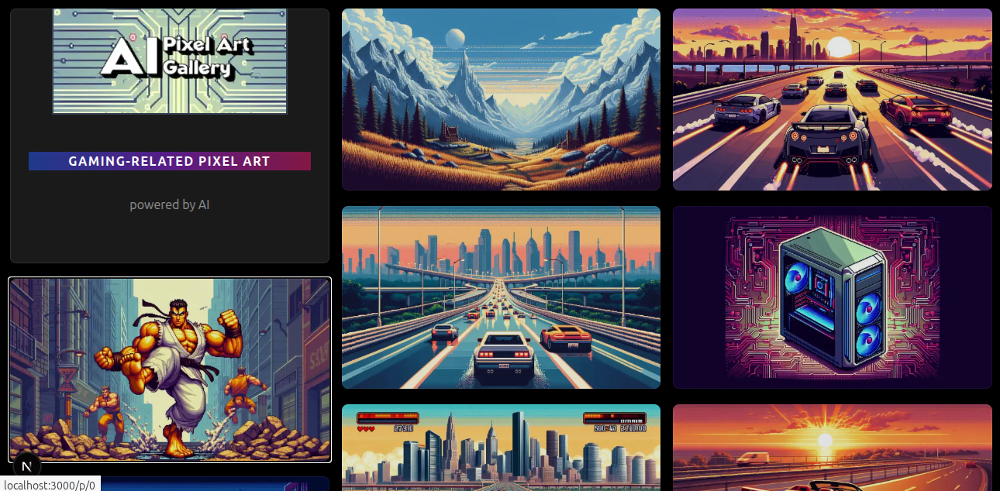
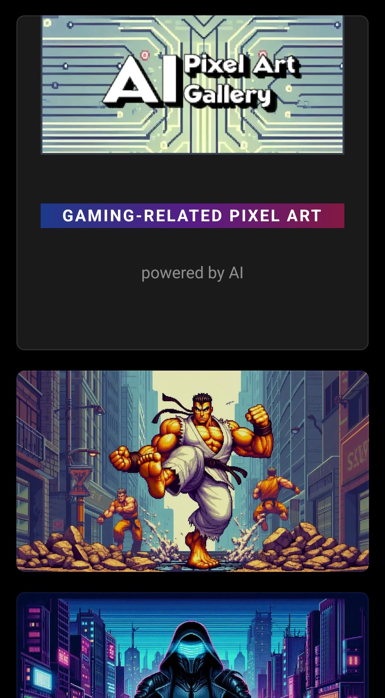

# AI Pixel Art Gallery

## Table of Contents
- [Screenshots](#screenshots)
- [Setup](#setup)
- [How to use](#how-to-use)


## Screenshots

### Desktop Web UI



### Mobile Web UI




## Setup

1. [Create a Vercel Blob store](https://vercel.com/docs/storage/vercel-blob) and upload your images to its root.

2. Create a `.env.local` file and set `BLOB_READ_WRITE_TOKEN` to the store's read/write token.


## How to use

Install dependencies
```bash
npm install
```

### Development mode

- Run the app (supports hot reloading)
  ```bash
  npm run dev
  ```

### Production mode

- Build the app and run it
  ```bash
  npm run build && npm run start
  ```
